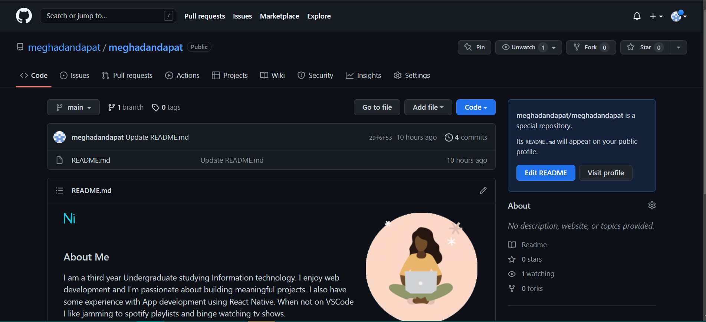

### 1) Create a new repository on GitHub.com. To avoid errors, do not initialize the new repository with README, license, or gitignore files. You can add these files after your project has been pushed to GitHub.

### 2) Open Git Bash.

### 3)Change the current working directory to your local project.

### 4) Initialize the local directory as a Git repository.

	$ git init -b main

### 5) Add the files in your new local repository. This stages them for the first commit.
    $ git add.
    # Adds the files in the local repository and stages them for commit. To unstage a file, use 'git reset HEAD YOUR-FILE'.

### 6) Commit the files that you've staged in your local repository.
    $ git commit -m "First commit"
    # Commits the tracked changes and prepares them to be pushed to a remote repository. To remove this commit and modify the file, use 'git reset --soft HEAD~1' and commit and add the file again.

### 7) At the top of your repository on GitHub.com's Quick Setup page, click  to copy the remote repository URL.

### 8) In the Command prompt, add the URL for the remote repository where your local repository will be pushed.
    $ git remote add origin  <REMOTE_URL>
    # Sets the new remote
    $ git remote -v
    # Verifies the new remote URL

### 9) Push the changes in your local repository to GitHub.com.
    $ git push origin main
    # Pushes the changes in your local repository up to the remote repository
